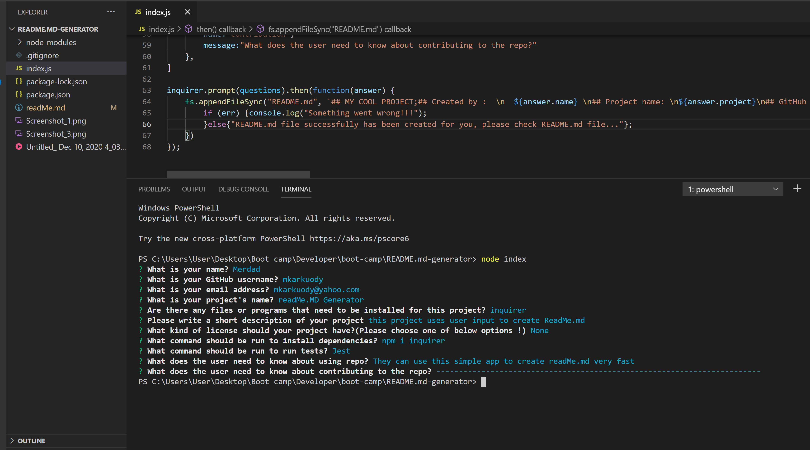

Good Readme Generator by Merdad Karkudi;
project repository link : https://github.com/mkarkuody/README.md-generator
Demo video link address : https://github.com/mkarkuody/README.md-generator/blob/main/Untitled_%20Dec%2010%2C%202020%204_03%20PM.mp4

Description
The following application is a command-line application that will create a "readme" file based off user input. In order to use the application, a user would have to navigate to where the "index.js" file is located and open up their terminal. The application can be started by typing the following command in the terminal and pressing the "enter" key:
node index.js
using package manager inquirer helps to prompt user and provide the user input to create readMe file we also need Fs that node Js provides for us to read write and append the required files, we require these packages in our index file to ask users to put their input so, user will be prompted with a series of questions regarding their GitHub username and project.Here is the quiestions: 
"What is your name?"
"What is your GitHub username?"
"What is your email address?"
"What is your project's name?"
"Are there any files or programs that need to be installed for this project?"
"Please write a short description of your project"
"What kind of license should your project have?(Please choose one of below options !)",
        choices: ["MIT License","Apache License", "GPLLicense", "None"],
"What command should be run to install dependencies?"
"What command should be run to run tests?"
"What does the user need to know about using repo?"
"What does the user need to know about contributing to the repo?";

Once complete , a "readme" file will be generated with the user's information and responses.
Technologies
This application uses the following: Node.js, Fs, and Inquirer.
